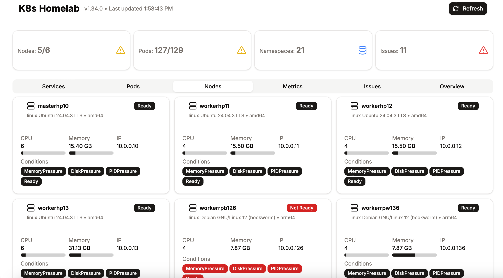
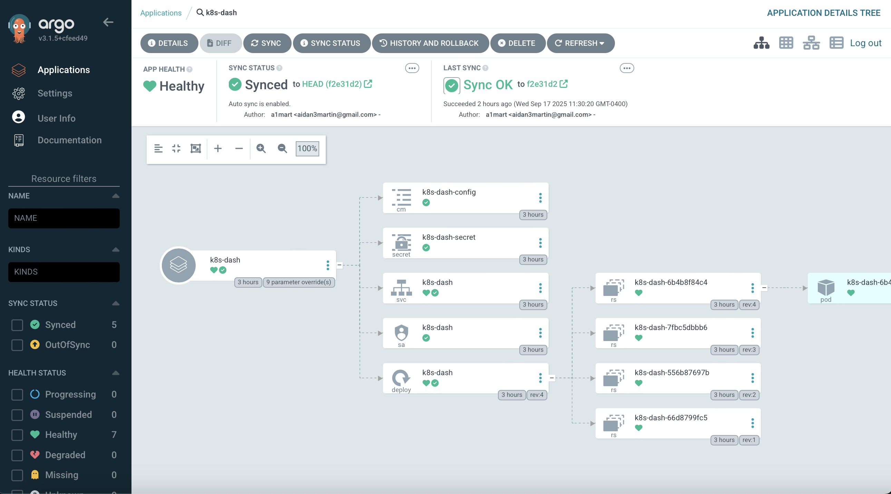

# Homepage

Homelab Cluster landing page linking to self-hosted services.  
It provides a central dashboard to access services like Keycloak, Hyperswitch, MinIO, and more.



---

## Features

- Central dashboard for your homelab services
- Easy local development using Docker
- Full deployment via ArgoCD and Helm
- Environment-configurable for multiple clusters
- Works with both local and remote Kubernetes contexts

---

## Deployment with ArgoCD

You can deploy the homepage directly from the Helm chart using ArgoCD:



- Sync the application from your Git repo
- Automatically manage updates and rollbacks
- Use Helm value overrides for environment-specific configuration

> **Tip:** Avoid storing secrets directly in your Git repo. Use Kubernetes `Secret`s and reference them via Helm parameters.

---

## Build and Run Locally with Docker
1. Navigate to the UI directory:
```bash
cd ui
```
2. Build the Docker image:
```bash
docker build -t k8sdash:latest .
```
3. Run the container with environment variables and access to your kubeconfig:
```bash
docker run -p 8080:3000 \
  --env-file .env.local \
  -v ~/.kube:/home/nextjs/.kube:ro \
  -e KUBECONFIG=/home/nextjs/.kube/config \
  k8sdash:latest
```
- The dashboard will be available at http://localhost:8080
- `.env.local` should include variables like `NEXTAUTH_URL`, `NEXTAUTH_SECRET`, and Keycloak client info.


## Environment Variables
Example .env.local:
```
NEXTAUTH_URL=http://localhost:3000
NEXTAUTH_SECRET=super-secure-password
KEYCLOAK_CLIENT_ID=k8s-dashboard
KEYCLOAK_CLIENT_SECRET=super-secret-client
KEYCLOAK_ISSUER=http://url/realms/alm
NEXT_PUBLIC_KEYCLOAK_URL=http://url
NEXT_PUBLIC_KEYCLOAK_REALM=realm
NEXT_PUBLIC_KEYCLOAK_CLIENT_ID=k8s-dashboard
```
**Note:** Secrets should **never** be committed to Git. Use `.env.local` for local development and Kubernetes Secrets for deployments.

## Contributing
1. Fork the repository
2. Make your changes in a feature branch
3. Test locally using Docker
4. Submit a pull request

## License
MIT License